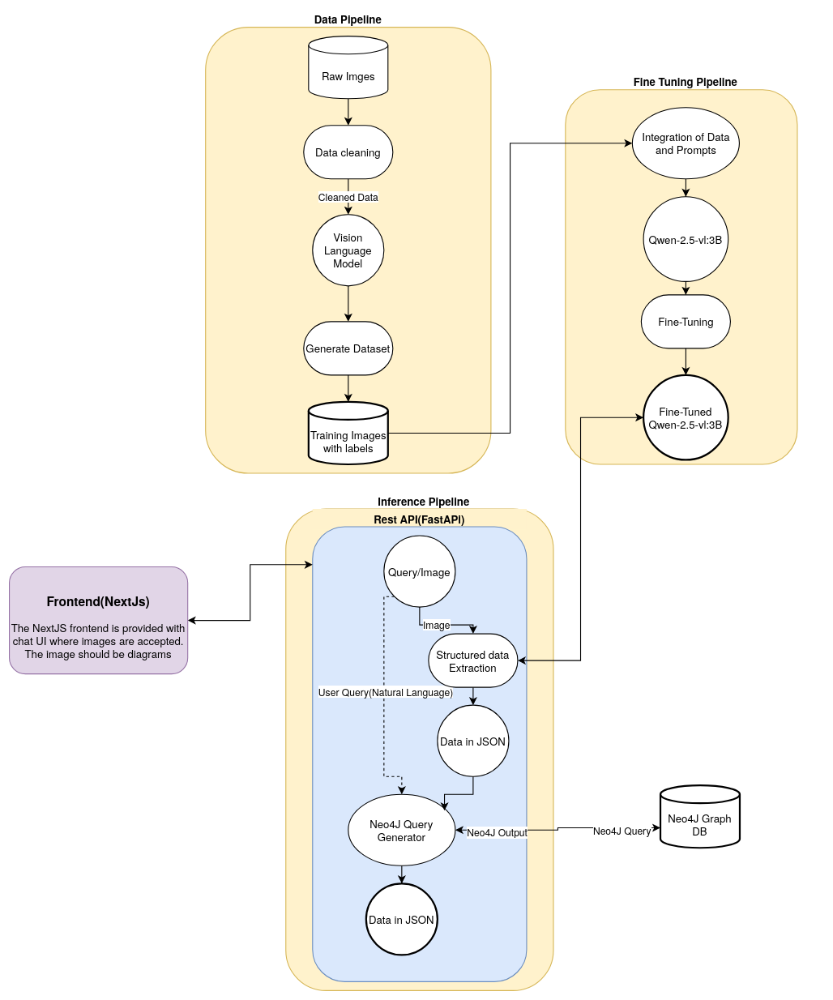

# Digitizing process and flow diagrams using Vision Language Models

[](https://huggingface.co/zackriya/diagram2graph) [](#license)

## Introduction

Building a system for converting images of process diagrams into structured Neo4J-compatible JSON format using AI-based Vision models. The project involves an initial exploration of the same using general purpose models(from Anthropic), followed by fine-tuning a smaller vision language model for improved performance and latency reduction.

## Objectives

- Extract diagrams information from images
- Exploring general purpose model(Claude3.5-sonnet)
- Comparison of image-to-cypher and image-to-json
- Develop a workflow for image-to-json(convertible to graph) conversion
- Finetune Vision language model Qwen2.5-vl-3b for image-to-json
- Implement a prototype for integration

## 🎯 Key Features

✅ **Diagram-to-Graph Conversion**  
Extract nodes, edges, and attributes from images into JSON for Neo4J ingestion

✅ **Optimized Performance**

- **+14% node detection** & **+23% edge detection** vs base model
- Runs on **3B-parameter Qwen2.5-VL** with LoRA fine-tuning

✅ **Privacy-First Design**  
No API dependencies—process diagrams locally

## 🛠️ How It Works

### Workflow Overview



1. **Input**: Image of a process/flow diagram
2. **Processing**: Vision-Language Model (VLM) extracts nodes/edges
3. **Output**: Structured JSON for representng knowledge graph

## 🔬 Technical Deep Dive

### Why Fine-Tuning a Smaller Model?

While large proprietary models like Claude 3.5 Sonnet demonstrated initial promise for diagram understanding, we identified strategic advantages in fine-tuning a smaller, open-source model for our task

💡 **Key Advantages**  
| Factor | Large Proprietary Models | Fine-Tuned Qwen2.5-VL |  
|----------------------|-----------------------------------------|-----------------------|  
| **Compute Cost** | High (API fees + cloud GPU usage) | Low (local inference) |  
| **Privacy** | Data sent to third-party APIs | On-premise processing |  
| **Customization** | Limited to API constraints | Full control via LoRA |

**Solution** : Fine-tune Qwen2.5-VL-3B with domain-specific data

### Dataset & Training

| Specification     | Details                         |
| ----------------- | ------------------------------- |
| **Training Data** | 200 hand-labeled diagrams       |
| **Method**        | LoRA (PEFT) + bf16 precision    |
| **Epochs**        | 10                              |
| **Hardware**      | 1x GPU (24GB+ VRAM recommended) |

### Evaluation Results

**Significant improvements in structured extraction accuracy**:

| Metric         | Base Model | Fine-Tuned | Improvement |
| -------------- | ---------- | ---------- | ----------- |
| Node Detection | 74.9% F1   | **89.1%**  | +14%        |
| Edge Detection | 46.05% F1  | **69.45%** | +23%        |

---

## 🚀 How to use

<a target="_blank" href="https://colab.research.google.com/github/Zackriya-Solutions/diagram2graph/blob/dev/phase2/inference/diagram2graph-inference.ipynb">
  
</a>

### Installation

```bash
pip install -q transformers accelerate datasets qwen-vl-utils[decord]==0.0.8
```

### Inference Example

```python
from transformers import Qwen2_5_VLForConditionalGeneration, Qwen2_5_VLProcessor
import torch

# Load fine-tuned model
model = Qwen2_5_VLForConditionalGeneration.from_pretrained(
    "zackriya/diagram2graph",
    device_map="auto",
    torch_dtype=torch.bfloat16
)
processor = Qwen2_5_VLProcessor.from_pretrained("zackriya/diagram2graph")

SYSTEM_MESSAGE = """You are a Vision Language Model specialized in extracting structured data from visual representations of process and flow diagrams.
Your task is to analyze the provided image of a diagram and extract the relevant information into a well-structured JSON format.
The diagram includes details such as nodes and edges. each of them have their own attributes.
Focus on identifying key data fields and ensuring the output adheres to the requested JSON structure.
Provide only the JSON output based on the extracted information. Avoid additional explanations or comments."""

# Process image
def run_inference(image):
    messages= [
        {"role": "system","content": [{"type": "text", "text": SYSTEM_MESSAGE}],},
        {"role": "user",
            "content": [
                {"type": "image","image": image,},
                {"type": "text","text": "Extract data in JSON format, Only give the JSON",},
            ],
        },
    ]

    text = processor.apply_chat_template(messages, tokenize=False, add_generation_prompt=True)
    image_inputs, _ = process_vision_info(messages)

    inputs = processor(
        text=[text],
        images=image_inputs,
        return_tensors="pt",
    )
    inputs = inputs.to('cuda')

    generated_ids = model.generate(**inputs, max_new_tokens=512)
    generated_ids_trimmed = [
        out_ids[len(in_ids):]
        for in_ids, out_ids
        in zip(inputs.input_ids, generated_ids)
    ]

    output_text = processor.batch_decode(
        generated_ids_trimmed,
        skip_special_tokens=True,
        clean_up_tokenization_spaces=False
    )
    return output_text
# Usage
output = run_inference(image)

# JSON loading
import json
json.loads(output[0])
```

---

## 📈 What's Next?

- **Dataset Expansion**: More Data
- **Ollama Integration**: Simplify local deployment
- **Python Library**: Plug-and-Play use

---

## 🙏 Acknowledgments

- [Qwen2.5-VL-3B](https://huggingface.co/Qwen/Qwen2.5-VL-3B-Instruct)
- [Roboflow's Fine-Tuning Guide](https://github.com/roboflow/notebooks)
- [Hugging Face Community](https://huggingface.co/)

---

## 📜 License

[Apache 2.0 License](LICENSE) | Developed by [Zackariya Solutions](https://www.zackriya.com/)

---

**Give us a ⭐️ if you like this work!**
