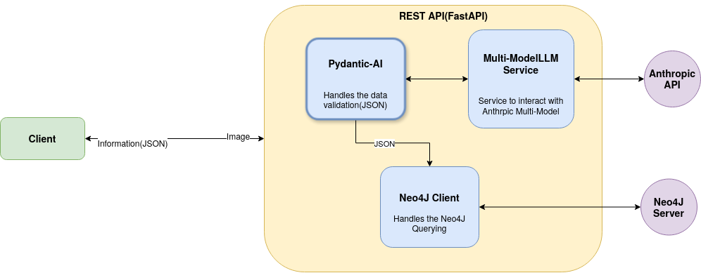

# Digitizing process and flow diagrams using Vision Language Models(PHASE-1)

## Introduction

Building Exploring the options for digitizing diagrams using general purpose models and ensuring the capability of vision language models for converting diagram images to structured output for efficient knowledge usage.

## Overview

This phase of the project focuses on digitizing diagrams by leveraging Claude-3.5-sonnet to extract structured JSON format. To ensure compatibility with Neo4J’s knowledge graph, Pydantic-AI is used for schema validation and structured output.Moreover the FastAPI ensures the seamless data management between the client and server, allowing efficient processing and retrieval of extracted diagram information

## High Level Architecture

## Observations

- The use Pydantic-AI is faced with a challenge of multi-modal compatibility, as pydantic-AI doesn’t support multi models, a workaround is essential like from this https://dev.to/stephenc222/how-to-use-pydanticai-for-structured-outputs-with-multimodal-llms-3j3a
- Faced with another challenge as the above article uses openAI specific methods to evaluate output internally, Unfortunately, Anthropic python SDK doesn’t provide that method.
- Continued with Anthropic specific method and it is working as expected.
- The implementation works with adding data at initial stage, but after that, the id is becoming an issue, because the id is generated by pydantic at it is not unique, so it overwriting the current graph with new data. The node matching mostly works with id’s
